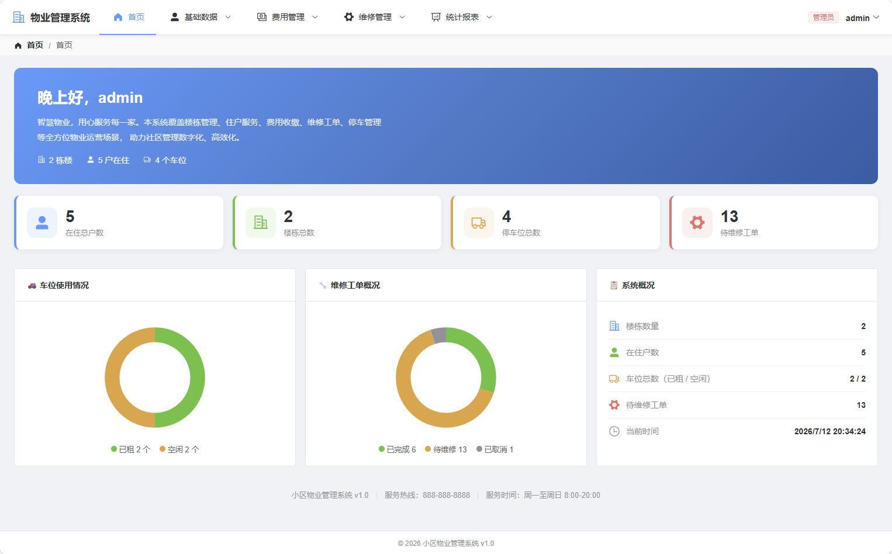

# 住宅小区物业管理系统

基于 Spring Cloud 微服务架构的住宅小区物业管理系统，支持楼栋管理、住户管理、物业费管理、停车位管理、维修工单管理及统计报表等功能。

## 📋 项目定位

JavaEE + 数据库课程设计项目，目标 **困难档（100分）**。需求文档详见 [`题目要求.md`](题目要求.md)，数据库设计详见 [`数据库设计文档.md`](数据库设计文档.md)。

## 📸 系统截图

### 登录界面


### 管理员首页



## 🏗️ 技术栈

| 层级 | 技术 | 说明 |
|------|------|------|
| **后端框架** | Spring Boot 3.2.12 | 微服务基础框架 |
| **微服务** | Spring Cloud 2023.0.3 + Spring Cloud Alibaba 2023.0.1.0 | 服务治理 |
| **注册中心** | Nacos 2.5.2 | 服务注册与配置中心 |
| **API 网关** | Spring Cloud Gateway | 统一入口、CORS、JWT 透传 |
| **服务调用** | OpenFeign | 服务间调用 |
| **安全** | Spring Security 6.x + JWT (jjwt 0.12.6) | 认证鉴权，HS256 签名，BCrypt 密码加密 |
| **ORM** | MyBatis-Plus 3.5.10.1 | 数据库操作 |
| **连接池** | Druid 1.2.23 | 数据库连接池 |
| **前端** | Vue 3 (Composition API) + Element Plus | SPA 应用 |
| **图表** | ECharts 6 | 统计报表可视化 |
| **构建工具** | Maven (后端) + Vite 8 (前端) | 构建与打包 |
| **数据库** | MySQL 8.0 | 关系型数据库 |
| **缓存** | Redis | 车位列表/报表缓存 |
| **开发语言** | Java 17 + JavaScript | — |

## 📐 项目架构

```
community-parent/
├── common/                        # 共享模块：Result<T> 统一响应类
├── gateway/        (端口 8080)    # API 网关：统一入口 + CORS + JWT 透传
├── user-service/   (端口 8081)    # 用户服务：认证、楼栋、住户、维修人员、维修工单
├── property-service/ (端口 8082)  # 物业费服务：物业费、停车位/停车费、统计报表
├── frontend/       (端口 5173)    # Vue 3 + Element Plus 前端
├── init.sql                       # 完整数据库架构 + 触发器 + 存储过程 + 测试数据
└── 数据库设计文档.md                # 数据库设计文档
```

### 系统架构图

```
┌──────────────────────────────────────────────────┐
│              Vue 3 + Element Plus                  │  前端 :5173
├──────────────────────────────────────────────────┤
│         Spring Cloud Gateway :8080                │  API 网关
│         (统一入口 + 全局CORS + JWT透传)              │
├─────────────────────┬────────────────────────────┤
│   user-service      │    property-service         │  微服务
│   :8081             │    :8082                    │
│   用户/住户/楼栋/报修  │    物业费/停车位/停车费/统计    │
├─────────────────────┴────────────────────────────┤
│         Nacos :8848 (服务注册 + 配置中心)            │
│         Spring Security + JWT (认证鉴权)           │
│         OpenFeign (服务间调用)                      │
│         MySQL 8.0 :3306 (数据库)                   │
│         Redis :6379 (缓存)                         │
└──────────────────────────────────────────────────┘
```

## 👥 用户角色与权限

| 角色 | 标识 | 说明 |
|------|------|------|
| 管理员 | `admin` | 系统最高权限，管理楼栋/住户/用户/费用/报表 |
| 维修员 | `maintenance` | 查看与更新分配给自己的维修工单 |
| 业主 | `resident` | 查看自家信息、缴费记录、停车位，在线报修缴费 |

> 详细权限矩阵见 [`数据库设计文档.md`](数据库设计文档.md)

## ✨ 功能模块

- **登录认证** — JWT 令牌认证，密码修改
- **楼栋管理** — 楼栋增删改查，查看楼栋下住户列表
- **住户管理** — 入住登记、搬离处理、信息修改、多条件查询
- **物业费管理** — 账单自动生成（按月）、收缴（单月/半年/一年）、截止日配置、催缴提醒
- **停车位管理** — 车位增删改查、分配/释放、停车费收缴
- **维修管理** — 业主报修、管理员分配任务、维修员更新工单、报修图片上传
- **统计报表** — 物业费/停车费月季年报表（ECharts 可视化）
- **业主自助** — 查看自家信息、缴费记录、在线缴费、在线报修

## 🚀 快速开始

### 环境要求

- **JDK** 17+
- **Maven** 3.8+
- **Node.js** 18+
- **MySQL** 8.0+
- **Nacos** 2.5.2
- **Redis**（可选，用于缓存与分布式锁）

### 1. 初始化数据库

```bash
mysql -u root -p < init.sql
```

> 该脚本会创建 `community_property` 数据库并插入测试数据。所有测试用户密码默认为 `123456`。
> BCrypt 密码哈希需在初始化后通过 `user-service` 测试目录中的 `PasswordGen.main()` 重新生成。

### 2. 启动 Nacos

```bash
cd nacos/bin
startup.cmd -m standalone    # Windows
# startup.sh -m standalone   # Linux / macOS
```

Nacos 控制台：http://localhost:8848/nacos （用户名/密码：`nacos` / `nacos`）

### 3. 启动 Redis（可选）

```bash
redis-server
```

> 若未启动 Redis，车位缓存和报表缓存功能将不可用，不影响核心业务。

### 4. 构建并启动后端服务

```bash
# 在项目根目录编译所有模块
mvn clean compile

# 按顺序启动各服务（各模块下执行 mvn spring-boot:run）
# 1. user-service     (端口 8081)
# 2. property-service  (端口 8082)
# 3. gateway           (端口 8080)
```

### 5. 启动前端

```bash
cd frontend
npm install
npm run dev
```

前端开发服务器：http://localhost:5173

### 测试账号

| 用户名 | 角色 | 密码 |
|--------|------|------|
| `admin` | 管理员 | `123456` |
| `zhangsan` | 业主 | `123456` |
| `lisi` | 业主 | `123456` |
| `wangwu` | 业主 | `123456` |
| `weixiu01` | 维修员 | `123456` |
| `weixiu02` | 维修员 | `123456` |

## 📁 目录结构

```
community-parent/
├── common/                          # 共享模块
│   └── src/main/java/com/community/
│       └── Result.java              # 统一响应类
├── gateway/                         # API 网关
│   └── src/main/java/com/community/gateway/
│       ├── GatewayApplication.java
│       ├── config/                  # CORS 配置
│       └── filter/                  # JWT 透传过滤器
├── user-service/                    # 用户服务
│   └── src/main/java/com/community/user/
│       ├── UserServiceApplication.java
│       ├── config/                  # Security、JWT 配置
│       ├── controller/             # Building、Household、User、Repair 控制器
│       ├── service/                # 业务逻辑层
│       ├── mapper/                 # MyBatis-Plus Mapper
│       └── entity/                 # 实体类
├── property-service/               # 物业费服务
│   └── src/main/java/com/community/property/
│       ├── PropertyServiceApplication.java
│       ├── config/                 # Redis 缓存配置
│       ├── controller/            # PropertyFee、ParkingSpace、ParkingFee 控制器
│       ├── service/               # 业务逻辑层（含定时任务）
│       ├── mapper/                # MyBatis-Plus Mapper
│       ├── entity/                # 实体类
│       └── util/                  # RedisLockUtil 分布式锁
├── frontend/                       # 前端项目
│   └── src/
│       ├── api/                    # API 请求封装
│       ├── components/            # 通用组件
│       ├── layouts/               # 布局组件
│       ├── router/                # 路由配置
│       ├── stores/                # Pinia 状态管理
│       ├── utils/                 # 工具函数（axios 拦截器等）
│       └── views/                 # 页面视图
├── init.sql                        # 数据库初始化脚本
├── 数据库设计文档.md                # 数据库设计文档
├── 题目要求.md                          # 需求文档
└── pom.xml                         # Maven 父 POM
```

## 🗄️ 数据库表设计

| 表名 | 说明 |
|------|------|
| `building` | 楼栋信息（楼号、总层数、每层户数） |
| `household` | 住户信息（房号、面积、户主、维修基金余额、在住/搬离） |
| `user` | 用户登录（用户名、BCrypt 密码、角色、关联 ID） |
| `maintenance_staff` | 维修员信息（工号、姓名、电话） |
| `property_fee` | 物业费缴费记录（按月，每户每月一条） |
| `parking_space` | 停车位信息（编号、租用住户、车牌号） |
| `parking_fee` | 停车费缴费记录（按月，每车位每月一条） |
| `repair` | 维修工单（报修内容、状态、金额、修复人） |
| `attachment` | 文件附件（报修图片等） |
| `system_config` | 系统配置（如缴费截止日） |

> 完整表结构、E-R 图、触发器、存储过程及索引设计见 [`数据库设计文档.md`](数据库设计文档.md)

## 🔑 关键设计决策

### 用户身份：`ref_id` 模式

`user` 表使用单一 `ref_id` 字段，根据 `role` 解释：
- **resident** → `ref_id` = `household_id`（真实姓名/电话从 `household` 表获取）
- **maintenance** → `ref_id` = `worker_no`（真实姓名/电话从 `maintenance_staff` 表获取）
- **admin** → `ref_id` = `NULL`（显示名直接使用 username）

### 缴费规则

- 费用记录**按月生成**（非预生成整年）
- 缴费时必须**先清已逾期月份**，再缴未来月份
- 缴费周期：1/6/12 个月
- 默认每月缴费截止日：**10 号**（可配置）
- `parking_fee.household_id` 在生成时**冻结**，不受后续车位换租影响

### 住户生命周期

- **入住** → 新建 `household` 记录 + 自动生成业主 `user` 账号
- **搬离** → 设置 `household.status=0` + 禁用关联 `user`
- **重新入住** → 总是新建 `household` 记录 + 新建 `user` 账号

### 账单状态流转

```
待缴(0) ──截止日后──▶ 逾期(-1)

待缴(0) ──缴费──▶ 已缴(1)

逾期(-1) ──缴费──▶ 已缴(1)

已缴(1) ──不再变更
```

## 📝 命名约定

| 术语 | 说明 | 示例 |
|------|------|------|
| 楼号 | building number | `28` |
| 层号 | floor number | `13` |
| 户号 | unit number | `02` |
| 房号 | 层号 + 户号 | `1302` |
| 住号 | 楼号-房号 | `28-1301` |
| 车位编号 | 大写字母 + 3位数字 | `A001`, `B002` |
| 用户名（业主） | `yz-楼号房号-时间戳` | `yz-281302-202607041759` |
| 用户名（维修员） | `wx-时间戳` | `wx-202607041759` |

